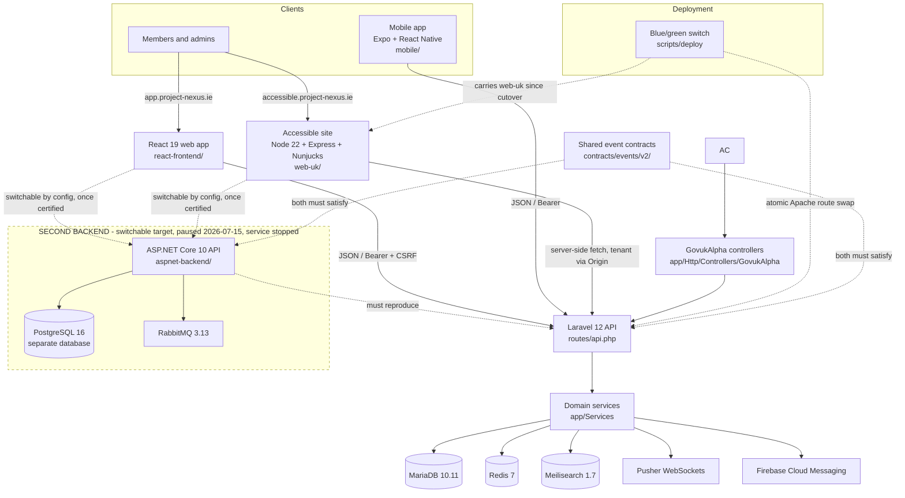

# Project NEXUS

[](https://github.com/jasperfordesq-ai/Project-NEXUS/actions/workflows/ci.yml)
[](https://github.com/jasperfordesq-ai/Project-NEXUS/actions/workflows/security-scan.yml)
[](https://www.bestpractices.dev/projects/13344)
[](LICENSE)
[](CHANGELOG.md)
[](https://docs.project-nexus.ie/)

**Backend** &nbsp;
[](composer.json)
[](composer.json)
[](compose.yml)
[](compose.yml)
[](compose.yml)

**Web app** &nbsp;
[](react-frontend/package.json)
[](react-frontend/package.json)
[](react-frontend/package.json)
[](react-frontend/package.json)
[](react-frontend/package.json)

**Accessible site** (the second frontend — live, in active development) &nbsp;
[](web-uk/package.json)
[](web-uk/package.json)
[](web-uk/package.json)
[](web-uk/package.json)

**Mobile** &nbsp;
[](mobile/package.json)
[](mobile/package.json)

**Second backend** (switchable, substantially built) &nbsp;
[](aspnet-backend/)
[](aspnet-backend/)
[](aspnet-backend/)

> 📖 **Documentation** — browse the full, searchable documentation site at **<https://docs.project-nexus.ie/>** (module guides, architecture, and an interactive API reference). The Markdown sources live in [docs/](docs/README.md).

> 🌐 **Live demo** — see the platform running in production: the [React frontend](https://app.project-nexus.ie) (primary UI) and the [accessible HTML-first frontend](https://accessible.project-nexus.ie). The PHP API is served from `https://api.project-nexus.ie`.

> **Version 1.6.0 — Generally Available** — Project NEXUS V1.6.0 is generally available and in active production use. Production runs a Laravel 12 + PHP 8.2+ API behind three clients: the React 19 web app, a GOV.UK-styled accessible site on Node 22 / Express, and an Expo / React Native mobile app. It is currently in use by communities in **Ireland** and being evaluated by communities in the **United Kingdom**, **Spain**, **Switzerland**, and the **United States**. Newer modules may still ship with their own per-module maturity label (Beta / Preview). Contributions and feedback are welcome.

A multi-tenant community time banking platform, and a genuinely full stack: a
Laravel 12 + PHP 8.2+ API on MariaDB, Redis and Meilisearch; a React 19 +
TypeScript web app; a separate GOV.UK-styled accessible site on Node 22 /
Express / Nunjucks; an Expo / React Native mobile app; and a second,
substantially complete ASP.NET Core 10 backend on its own PostgreSQL and
RabbitMQ, which the clients can be switched to by configuration once it is
certified contract-identical. Every one of those lives in this repository — see
[Tech Stack](#tech-stack) for what production actually serves today.

## Contents

- [What is Time Banking?](#what-is-time-banking)
- [Features](#features)
- [Tech Stack](#tech-stack)
- [Architecture](#architecture)
- [Repository Topology](#repository-topology)
- [Quick Start](#quick-start)
- [Database Setup](#database-setup)
- [Project Status](#project-status)
- [Quality, Security, and Releases](#quality-security-and-releases)
- [Documentation](#documentation)
- [Contributing & Support](#contributing--support)
- [Credits and Origins](#credits-and-origins)
- [License](#license)
- [UI Attribution Requirement](#ui-attribution-requirement)
- [Related Projects](#related-projects)

## What is Time Banking?

Time banking is a community-based system where members exchange services using time as currency. One hour of service always equals one time credit, regardless of the type of service — everyone's time is valued equally.

## Features

- **Time Credits & Wallet** — Earn and spend time credits for community services
- **Listings Marketplace** — Browse and post service offers and requests
- **Private Messaging** — Connect directly with community members
- **Events** — Organise community gatherings with RSVP tracking
- **Groups** — Interest-based community groups and discussions
- **Social Feed** — Community posts, comments, likes, and polls
- **Gamification** — Badges, achievements, XP, leaderboards, and challenges
- **Volunteering** — Volunteer opportunities and hour logging
- **Blog & Resources** — Community news and shared resource library
- **Federation** — Two separate things under one name. **Inside one installation:** communities you host can share members, listings and exchanges with each other, and this is on by default. **Between installations:** eight protocols let other platforms connect to yours, and these all ship **switched off** behind a per-protocol kill switch until you deliberately enable them. If you are self-hosting and expecting external federation to work out of the box, it will not — that is intentional. See [docs/FEDERATION_API_MANUAL.md](docs/FEDERATION_API_MANUAL.md), which opens with the status of each protocol.
- **Smart Matching** — AI-powered matching of members and listings
- **Exchange Workflow** — Broker-approved service exchange lifecycle
- **Multi-Tenant** — Run multiple communities from one platform, each with its own branding and configuration
- **PWA & Native Mobile** — Progressive Web App, with native app packaging managed outside the default Docker setup
- **Real-Time** — Pusher WebSockets for live updates, FCM for mobile push
- **Internationalisation** — 11 supported languages: English, Irish (Gaeilge), German, French, Italian, Portuguese, Spanish, Dutch, Polish, Japanese, Arabic (with full RTL support)
- **Light/Dark Theme** — System-aware theme with per-user preference

## Tech Stack

Project NEXUS is a full stack in the literal sense: **two backends and five
clients** live in this repository, in four languages (PHP, TypeScript,
JavaScript, C#) across two runtimes and two databases. They are not equal in
status, and the difference matters more than the technology list.

### Primary — this is what production runs

| Layer | Technology | Served at |
|-------|-----------|-----------|
| **Backend API** | Laravel 12 + PHP 8.2+ | `api.project-nexus.ie` |
| **React web app** | React 19 + TypeScript 5.7 + HeroUI v3 + Tailwind CSS 4 + Vite 7 (`react-frontend/`) | `app.project-nexus.ie` |
| **Accessible site** | Node 22 + Express 4 + Nunjucks 3.2 + GOV.UK Frontend 6.4, HTML-first, consuming the Laravel API (`web-uk/`) | `accessible.project-nexus.ie`, community accessible domains, and `/{tenantSlug}/accessible/...` |
| **Mobile app** | Expo 54 + React Native 0.81 + React 19, a separate codebase on the same API (`mobile/`) | Android and iOS builds; neither store release is published yet |
| **Sales site** | Static commercial site | `project-nexus.ie` |

**The accessible site is a full application, not a set of templates.** `web-uk/`
has its own HTTP server, routing layer, middleware, session store, view layer,
asset pipeline, brand-compliance checks, Jest suite (74 test files, 1,787 tests)
and its own production container. It talks to the platform over the same public
HTTP API the React app uses, which is exactly why it can be pointed at either
backend once the second one is certified.

**It is under active development.** Work on the accessible frontend resumed on
2026-08-11, it took over the platform accessible domain the following day, and it
is the track currently being built out — unlike the second backend, which remains
paused. The two were paused together on 2026-07-15 and their states have since
diverged; do not read one's status from the other.

🔴 **There are two accessible frontends and the changeover is half-done.** The
Node application took over `accessible.project-nexus.ie` on **2026-08-12**; the
Blade one still serves every community accessible domain and every
`/{tenantSlug}/accessible/...` path, and retires when the rest of the changeover
completes. Both answer identical public URLs, so `/version` is the only way to
tell which one replied. Status is stated once, in
[docs/ACCESSIBLE-FRONTEND-TAKEOVER.md](docs/ACCESSIBLE-FRONTEND-TAKEOVER.md).

**The clients are backend-switchable by configuration** — the React app selects
its target with `VITE_BACKEND_TARGET=laravel|dotnet`, and backend-specific
differences are confined to small adapter modules rather than spread through the
codebase. Laravel is the production default and the contract source of truth. The
stated end state is **two frontends by two backends**, in which neither frontend
changes behaviour when its backend changes; see
[docs/REACT-DUAL-BACKEND.md](docs/REACT-DUAL-BACKEND.md).

🔴 **On the mobile app:** it is a distinct Expo / React Native codebase (v1.2.0,
257 screens, 217 test files), not a wrapper around the web build. `mobile/app.json`
configures both platforms, but only the Android release path is complete — signing,
build profiles and push credentials exist for Android, while the iOS submit
configuration is still a placeholder and Apple additionally requires a developer
account and review. A Capacitor wrapper also exists historically; its project
directory is **not** in this repository (removed in `df8bf84d6`, gitignored) and it
is not what we ship.

### The second backend — a switchable ASP.NET Core 10 stack

| Layer | Technology | State |
|-------|-----------|-------|
| **ASP.NET backend** | ASP.NET Core 10 + EF Core + PostgreSQL 16 + RabbitMQ 3.13 (`aspnet-backend/`) | Substantially built: 254 controllers, 165 migrations, 393 test files / 3,386 tests. **712/1000** on the `ASPNET-CONTRACT-R1` rubric as at the **2026-07-15** pause. Service stopped 2026-08-10, domain retained |
| **Shared event contracts** | JSON Schema event contracts both backends must satisfy (`contracts/events/v2/`) | Maintained |

This is not a sketch or a spike. It is a **complete stack of its own** — its own
database, message broker, migrations, messaging layer and test suite, sharing
nothing with Laravel — built so that either backend can serve the same clients.
Progress is measured against a fixed 1,000-point rubric that asks a single
question: is it *externally contract-identical* to Laravel? It stood at 712 when
development paused on 2026-07-15, and the remaining work is a finite, ordered
queue rather than an open-ended research problem. That figure is a snapshot of a
paused workstream, not a live counter — when work resumes, read the canonical
status document rather than this page.

Two things are true at once and both matter: the code is solid and close to
finished, **and** it is not certified, not the production default, and not
deployable from here. Laravel decides the contract; ASP.NET must reproduce it.

It is also not an assumed successor to Laravel. Laravel remains the canonical
production backend with no automatic user-count or traffic threshold for a
cutover. ASP.NET preserves a future option for operators or measured workloads
that genuinely benefit from .NET; any production proposal needs comparative
Project NEXUS evidence, operational and migration readiness, and a separate
owner decision. See
[`ADR-0002`](aspnet-backend/docs/decisions/ADR-0002-laravel-production-authority-and-aspnet-optionality.md).

🔴 Its presence changes nothing about what deploys today. Current score, evidence
boundary and resume queue: `aspnet-backend/docs/CURRENT_ASPNET_CONTRACT_STATUS.md`
— the canonical source, and the only figure to quote. 🔴 **Never add its score to
the accessible frontend's**: two 1,000-point rubrics exist and they measure
different things. Enforced isolation:
[docs/PLATFORM-MONOREPO.md](docs/PLATFORM-MONOREPO.md).

### Shared infrastructure and tooling

| Layer | Technology |
|-------|-----------|
| **Database** | MariaDB 10.11 (Laravel) · PostgreSQL 16 (ASP.NET, separate) |
| **Cache / queue** | Redis 7 · RabbitMQ 3.13 (ASP.NET only) |
| **Search** | Meilisearch 1.7 |
| **CDN / edge** | Cloudflare (9 zones, purged automatically after every deploy) |
| **Real-Time** | Pusher (WebSockets) + Firebase Cloud Messaging |
| **PWA** | Installable web app with per-tenant manifests; `/install-app` explains what installs where |
| **Payments / identity** | Stripe (payments, Connect, Identity) |
| **Error monitoring** | Sentry (PHP, React and Node), with a 30-minute post-deploy watch |
| **Dev Environment** | Docker-first local stack; native Vite proxies to Docker PHP |
| **Icons / charts / editor** | Lucide React · Recharts · Lexical · GrapesJS + MJML (newsletters) |
| **Animations** | CSS transitions via a local motion shim (no framer-motion) |
| **Testing** | PHPUnit · PHPStan · Vitest (8 shards) · Playwright · axe-core · xUnit (ASP.NET) · dependency-free load tester (`scripts/load-test.mjs`) |
| **Deployment** | Zero-downtime blue/green container switch behind Apache, with CI-evidence and migration-safety gates |

## Architecture

A multi-tenant Laravel 12 API serving four production clients — a React 19 web
app, two HTML-first accessible frontends mid-changeover, and a native mobile app
— backed by MariaDB, Redis and Meilisearch, deployed by a zero-downtime
blue/green container switch.

Alongside them, and deliberately fenced off from production, sits a second
complete backend that the same clients are built to switch to by configuration.



**Reading the diagram:** everything outside the dashed box is production. The two
accessible sites both answer live traffic today — the Node one on the platform
accessible domain since 2026-08-12, the Blade one on community domains and
slug paths — and the changeover finishes when Blade is retired. Inside the dashed
box is a parallel backend that reproduces the contract surface on purpose, with
its own API, database and message broker. Its dashed arrows are an obligation and
an intention rather than live traffic: ASP.NET must reproduce Laravel's
externally observable contracts, and both the React app and the accessible site
are built to switch to it by configuration alone once that is certified. That
switch is the point of the exercise — a community running this platform should be
able to change the engine underneath without its members noticing.

🔴 **The ASP.NET service** is stopped, its domain retained, and it was deployed
from a repository archived on 2026-08-10 — **this repository has no deploy path to
it**, by design. The Node accessible site is the opposite case: it *is* deployed
from here, and after the cutover every deploy must pass `--with-webuk` or it
refuses to run.

The full architecture map — runtime boundaries, tenant/feature model, and
cross-cutting requirements — is in **[docs/ARCHITECTURE.md](docs/ARCHITECTURE.md)**.
Boundaries, provenance and deployment isolation for the two secondary tracks are
in **[docs/PLATFORM-MONOREPO.md](docs/PLATFORM-MONOREPO.md)**.

## Repository Topology

| Path | Purpose |
|------|---------|
| `app/`, `routes/`, `config/`, `bootstrap/` | **PRIMARY.** Laravel 12 application, API routing, middleware, providers, and runtime configuration. The contract source of truth for every client. |
| `react-frontend/` | **PRIMARY.** React 19 + TypeScript UI for members and admin workflows. Backend-switchable by configuration; Laravel is the production default. |
| `web-uk/` | **PRIMARY.** A complete standalone accessible client — Express 4 + Nunjucks + GOV.UK Frontend 6.3 on Node 22, with its own server, sessions and 1,787 tests, consuming the Laravel API. **The sole accessible frontend** since the Laravel Blade one was deleted on 2026-08-14 — it serves `accessible.project-nexus.ie` (since 2026-08-12), both community accessible domains, and `/{tenantSlug}/accessible/...` for every community. Deployed from this repository; **every deploy must pass `--with-webuk`** or the accessible addresses go down. |
| `mobile/` | **PRIMARY.** The native mobile app — Expo 54 + React Native 0.81 + React 19, its own codebase (v1.2.0, 257 screens, 217 test files) on the same Laravel API, with its own translation tree covering 7 locales. Android release path complete; iOS configured but not published. |
| `aspnet-backend/` | **SECOND BACKEND.** A substantially complete alternative backend — ASP.NET Core 10, EF Core, its own PostgreSQL 16 database and RabbitMQ, 254 controllers, 165 migrations, 3,386 tests — which the clients can be switched to by configuration once it is certified contract-identical to Laravel. **712/1000** on the `ASPNET-CONTRACT-R1` rubric as at the **2026-07-15** pause. Service stopped 2026-08-10, domain retained, code alive and maintained here. Not deployable from this repository. |
| `contracts/events/v2/` | JSON Schema event contracts that both backends must satisfy — the machine-readable half of the contract-comparison work. |
| `views/` | Live email templates (`views/emails/match_*.php`) and the module-404 page; everything else under `views/` is retired legacy code |
| `httpdocs/` | Apache web root, public health endpoints, and compatibility entrypoints |
| `database/`, `migrations/` | Laravel migrations, schema dump, and legacy SQL history |
| `tests/`, `e2e/`, `playwright.config.ts` | PHPUnit, integration, and browser test coverage |
| `docs/` | Maintained public operations, platform, and governance documentation |
| `.github/` | CI, security, contributor, release, and dependency automation |
| `scripts/` | Build, migration, deployment, maintenance, and audit tooling |

🔴 **"Not deployable from this repository" does not mean "not running."** The
ASP.NET service was deployed from a separate repository archived on 2026-08-10,
so nothing here can update it — but its domain is retained and its code is
maintained here. An earlier version of this file said the same of `web-uk/`; that
stopped being true on 2026-08-12, when it took over the platform accessible
domain and became part of the production deploy.

The tiers are enforced, not merely described: no secondary job can block a
production release, `aspnet-backend/` cannot enter the production image, and no
deploy script references it. See
[docs/PLATFORM-MONOREPO.md](docs/PLATFORM-MONOREPO.md).

Native mobile builds are not required for the public Docker setup — `mobile/` has
its own Expo toolchain and release process, and the React web app remains the
canonical desktop interface.

## Quick Start

```bash
# Clone the repository
git clone https://github.com/jasperfordesq-ai/Project-NEXUS.git
cd Project-NEXUS

# Copy the example environment file and fill in your values
cp .env.docker.example .env.docker

# Start the Docker PHP app, database, Redis, and Meilisearch
docker compose --profile docker-php up -d app

# Start the React frontend with native Vite (proxies /api to Docker PHP)
npm run dev:frontend

# Run Laravel migrations and first-run seed data
docker exec nexus-php-app php artisan migrate --seed

# Access the application
# React Frontend: http://localhost:5173
# PHP API:        http://localhost:8090
#
# First login, unless you changed NEXUS_BOOTSTRAP_ADMIN_* in your env file:
# Email:    admin@project-nexus.local
# Password: ChangeMe123!
#
# Two surfaces need an extra step and are NOT up after the commands above:
#
#   Sales site      opt-in Compose profile:
#                   docker compose --profile docker-sales up -d sales
#                   then http://localhost:3001
#
#   Accessible UI   served at /{communitySlug}/accessible, and the seeder creates
#                   only the Master Tenant, which has no slug. Create a community
#                   in the admin panel first, then use its slug:
#                   http://localhost:8090/<your-slug>/accessible

# Native app packaging is separate from the default Docker workflow
```

## Database Setup

Run Laravel migrations and the first-run seeder after starting Docker:

```bash
docker exec nexus-php-app php artisan migrate --seed
```

The first-run seeder creates the master tenant (`tenant_id=1`) and a local platform administrator. The default development credentials are `admin@project-nexus.local` / `ChangeMe123!`; override them with `NEXUS_BOOTSTRAP_ADMIN_EMAIL` and `NEXUS_BOOTSTRAP_ADMIN_PASSWORD` before seeding.

The full current schema dump is committed at [database/schema/mysql-schema.sql](database/schema/mysql-schema.sql). Zero-downtime deployments use a blue/green container switch (see `scripts/deploy/bluegreen-deploy.sh`).

## Project Status

This is **version 1.6.0 — generally available**, in active production use. Per-module maturity (GA / Beta / Preview) is published on the in-app `/features` page and the public Changelog:

- The **React frontend** (`react-frontend/`) is the primary UI for user-facing pages and current admin workflows
- The **accessible site** (`web-uk/`, Node 22 + Express + Nunjucks + GOV.UK Frontend) is an approved HTML-first UI track and is the sole accessible frontend. It serves `accessible.project-nexus.ie`, both community accessible domains, and `/{tenantSlug}/accessible/...` for every community. The Laravel Blade implementation it replaced was deleted on 2026-08-14.
- The **mobile app** (`mobile/`) is a separate Expo / React Native client on the same API — Android release path complete, iOS configured but not yet published to either store
- The **Laravel 12 backend** provides the API — all services are native Laravel implementations (zero stubs)
- The **second backend** (`aspnet-backend/`, ASP.NET Core 10 on PostgreSQL 16 and RabbitMQ) is substantially built and maintained here — 712/1000 against the contract-identity rubric at the 2026-07-15 pause, intended as a configuration-switchable alternative to Laravel; its service is stopped, so it is not certified and not the production default
- The **legacy PHP admin** (`/admin-legacy/`, `/super-admin/`) has been decommissioned — all admin workflows live in the React admin
- **Zero-downtime blue/green deployments** — production switches between blue and green container stacks with no maintenance window
- **Tests** are in `tests/`, `react-frontend/src/**/*.test.*`, and `e2e/`; CI also runs static analysis, build, migration, i18n, SPDX, smoke, accessibility, and security gates

We welcome contributors comfortable in any part of this stack — PHP/Laravel, React/TypeScript, Node/Express, React Native, or C#/ASP.NET. You do not need to know all of it.

## Quality, Security, and Releases

- Security reports use the private process in [SECURITY.md](SECURITY.md).
- Contributor behaviour expectations are documented in [CODE_OF_CONDUCT.md](CODE_OF_CONDUCT.md).
- Maintained project documentation starts at [docs/README.md](docs/README.md).
- Public documentation changes are checked with `npm run check:docs`.
- Platform version references are checked with `npm run check:version`; update `VERSION`, Composer, React package metadata, the README, release status, and current public collateral together.
- Release-relevant changes must update [CHANGELOG.md](CHANGELOG.md) under `[Unreleased]`, then refresh the bundled app copy with `npm --prefix react-frontend run copy-changelog`.
- Dependency updates are managed by Dependabot for Composer, npm, Docker, and GitHub Actions.
- Pull requests run dependency review, CI, security scanning, i18n drift checks, SPDX checks, E2E smoke tests, and accessibility checks.
- GitHub Releases are created from version tags; see [.github/RELEASE_PROCESS.md](.github/RELEASE_PROCESS.md).

## Documentation

Maintained documentation starts at **[docs/README.md](docs/README.md)** and follows the standards in [docs/DOCUMENTATION.md](docs/DOCUMENTATION.md) (Diátaxis, Google/GitLab style, OpenAPI-first).

| Area | Start here |
|------|-----------|
| **Architecture** | [docs/ARCHITECTURE.md](docs/ARCHITECTURE.md) |
| **API** | [docs/API.md](docs/API.md) (contract: [`openapi.json`](openapi.json)) |
| **Deployment & operations** | [docs/DEPLOYMENT.md](docs/DEPLOYMENT.md), [docs/RUNBOOK-INCIDENTS.md](docs/RUNBOOK-INCIDENTS.md) |
| **Module guides** | [docs/MODULES.md](docs/MODULES.md) |
| **Frontend conventions** | [react-frontend/CLAUDE.md](react-frontend/CLAUDE.md) |
| **Accessible frontend** | [docs/govuk-alpha/RESEARCH.md](docs/govuk-alpha/RESEARCH.md) |

## Contributing & Support

- **Contributing** — start with [CONTRIBUTING.md](CONTRIBUTING.md) (environment setup, workflow, coding standards, SPDX headers) and the [CONTRIBUTOR_TERMS.md](CONTRIBUTOR_TERMS.md).
- **Project governance** — how the project is maintained and decisions are made: [GOVERNANCE.md](GOVERNANCE.md).
- **Code of conduct** — [CODE_OF_CONDUCT.md](CODE_OF_CONDUCT.md).
- **Getting help** — [SUPPORT.md](SUPPORT.md) explains where to ask questions, report bugs, and request features.
- **Security** — report vulnerabilities privately via [SECURITY.md](SECURITY.md).

## Credits and Origins

### Creator

This software was created by **Jasper Ford**.

### Founders

The originating time bank initiative [hOUR Timebank CLG](https://hour-timebank.ie) was co-founded by:

- **Jasper Ford**
- **Mary Casey**

### Contributors

- **Steven J. Kelly** — Community insight, product thinking
- **Sarah Bird** — CEO, Timebanking UK

### Research Foundation

This software is informed by and builds upon a social impact study commissioned by the **West Cork Development Partnership**.

### Acknowledgements

- **West Cork Development Partnership**
- **Fergal Conlon**, SICAP Manager

### Third-party open-source components

Project NEXUS builds on many open-source projects — including [GrapesJS](https://grapesjs.com) and [MJML](https://mjml.io) (the drag-and-drop newsletter builder), React, HeroUI, Tailwind CSS, and Laravel. Each retains its own licence and copyright; see [THIRD_PARTY_NOTICES.md](THIRD_PARTY_NOTICES.md) (attribution) and [THIRD_PARTY_LICENSES.md](THIRD_PARTY_LICENSES.md) (full inventory). Run `npm run check:licenses` to re-audit the dependency tree.

## License

This software is licensed under the **GNU Affero General Public License version 3** (AGPL-3.0-or-later).

The AGPL requires that if you run a modified version of this software on a server and let others interact with it, you must make your source code available to those users.

See the [LICENSE](LICENSE) file for the full license text.
See the [NOTICE](NOTICE) file for attribution requirements.
See [THIRD_PARTY_NOTICES.md](THIRD_PARTY_NOTICES.md) for bundled third-party components and their licences.

## UI Attribution Requirement

Under AGPL Section 7(b), all public deployments of this software **must** display visible attribution and a link to the source code repository.

### Required Attribution

**Footer (all pages):**
> "Built on Project NEXUS by Jasper Ford"

This text must be a clickable hyperlink to: <https://github.com/jasperfordesq-ai/Project-NEXUS>

**About page:**
> "Powered by Project NEXUS
> Created by Jasper Ford
> Licensed under AGPL v3"

With a link to: <https://github.com/jasperfordesq-ai/Project-NEXUS>

### Compliance

- The [NOTICE](NOTICE) file contains the authoritative wording for all attribution requirements
- Removing or obscuring required attribution is a licence violation
- This requirement applies to all deployments, including modified versions and SaaS offerings

## Related Projects

Project NEXUS is moving toward two backend editions that can share the same
React frontend contract:

| Edition | Stack | Repository |
| ------- | ----- | --------- |
| **Laravel Edition** (production/default) | Laravel 12 + PHP 8.2+ / React 19 / MariaDB | Repository root |
| **.NET Edition** (experimental) | ASP.NET Core 10 / PostgreSQL | [`aspnet-backend/`](aspnet-backend/README.md) |
| **Shared Web UK frontend** (production) | Express / Nunjucks / GOV.UK Frontend | [`web-uk/`](web-uk/README.md) |

The **Laravel Edition** at the repository root is the canonical, in-production platform and the foundation of all Project NEXUS communities. It runs on Laravel 12 + PHP 8.2+ with the production React 19 frontend. The **.NET Edition** is an experimental, development-only backend in `aspnet-backend/` that must conform to Laravel's external contracts before either unchanged frontend can safely target it. The portability roadmap and safety rules are documented in [docs/REACT-DUAL-BACKEND.md](docs/REACT-DUAL-BACKEND.md) and [docs/PLATFORM-MONOREPO.md](docs/PLATFORM-MONOREPO.md).

## Source Code

The complete source code for this project is available at:
<https://github.com/jasperfordesq-ai/Project-NEXUS>
