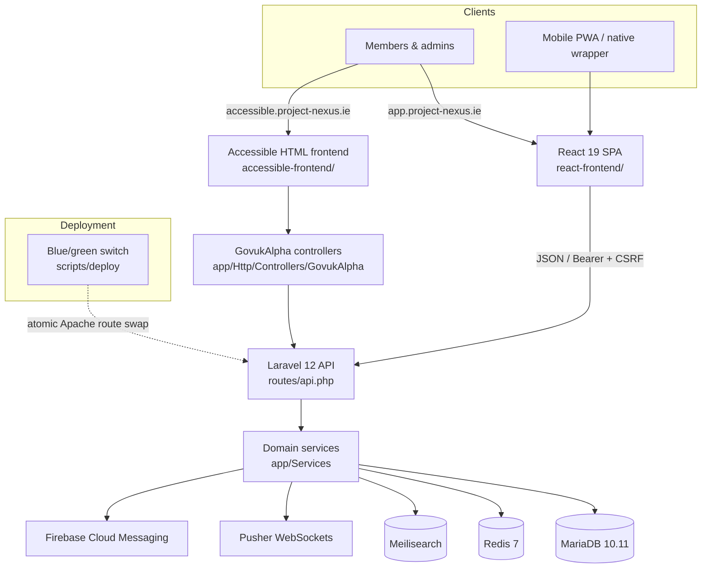

# Project NEXUS Architecture

Last reviewed: 2026-07-30
Platform version: 1.5.9

This document is the maintained architecture map for Project NEXUS. It is intentionally compact: use it to understand the runtime boundaries, primary code paths, and documents to read next.

## System Shape

Project NEXUS is a multi-tenant community platform for timebanking and adjacent community-exchange workflows. The production system is a Laravel 12 API/backend, a React 19 primary frontend, an HTML-first accessible frontend, MariaDB, Redis, Meilisearch, Pusher, Firebase Cloud Messaging, and supporting deployment/observability tooling.

## Runtime Boundaries

| Surface | Primary path | Responsibility |
| --- | --- | --- |
| React app | `react-frontend/` | Main member UI, current admin UI, PWA shell, translated client experience. |
| Accessible frontend | `accessible-frontend/`, `app/Http/Controllers/GovukAlpha/` | HTML-first tenant UI for users who benefit from simpler progressive enhancement. |
| Laravel API | `routes/api.php`, `app/Http/Controllers/Api/` | JSON API for React, mobile, integrations, and admin operations. |
| Domain services | `app/Services/` | Business rules for listings, exchanges, federation, volunteering, messages, notifications, reporting, and adjacent modules. |
| Data model | `database/migrations/`, `database/schema/mysql-schema.sql`, `migrations/` | Current Laravel migrations, schema dump, and historical SQL migration record. |
| Public web root | `httpdocs/` | Apache entrypoints, health endpoints, version endpoint, and compatibility routing. |
| Legacy views | `views/` | Retired PHP UI except the documented live email and module-404 exceptions. |

## Tenant and Feature Model

All business logic must preserve tenant isolation. PHP code should resolve tenant scope through the established tenant context/middleware patterns, and React code should use the tenant context/hooks already present in `react-frontend/src/`.

Feature availability is tenant-configured. User-facing routes, API actions, accessible frontend pages, notifications, search entries, and navigation should all check the same feature gate rather than assuming a module is globally enabled.

## Authorisation Model

Authorisation has five tiers — member, broker/coordinator, administrator, network administrator, platform administrator — expressed as a `users.role` string plus boolean flags, with `app/Support/Authorization/AdminTier.php` as the canonical predicate. A broker is an *operational* role with its own application and its own routes, not a junior administrator; `AdminTier` deliberately excludes it from the admin tier.

Cross-tenant reach inside the super-admin panel is graded rather than absolute. `app/Core/SuperPanelAccess.php` resolves a level: `master` (platform-global) or `regional` (the actor's own hub tenant and its descendants only, enforced by a materialised-path prefix match). Any cross-tenant action must check both the source and the destination tenant.

A second permission/RBAC schema (`roles`, `permissions`, `user_roles`, `user_permissions`, with per-organisation scoping) coexists with the tier model and is used for a narrow, specific set of capabilities. It has not replaced the tier model, and a grantable permission slug is not necessarily an enforced one.

See [ROLES-AND-PERMISSIONS.md](ROLES-AND-PERMISSIONS.md).

## Safeguarding and Consent

Safeguarding, guardian relationships and consent form a substantial subsystem of roughly thirty tables spanning four largely independent mechanisms: staff-created guardian↔ward assignments, per-event guardian consent for minors, per-opportunity guardian consent for volunteering, and member-to-member linked accounts. Consent records are versioned and hashed with provenance; the per-event implementation additionally uses encrypted guardian identity, single-use expiring tokens, and an append-only history table protected by database triggers.

Concern-raising is separate again: `safeguarding_reports` is a case-management workflow with severity-driven SLAs, escalation and an append-only action log, distinct from generic content reporting. There are currently four independent reporting systems across the platform.

Two architectural rules follow from how this is built. A relationship record is never itself authorisation — a guardian gains no capability unless an explicit check grants it. And a permission must not be presented to users unless something enforces it.

See [SAFEGUARDING-AND-CONSENT.md](SAFEGUARDING-AND-CONSENT.md).

## Reporting and Analytics

Reporting is not a single subsystem. There are roughly twenty-five admin-facing report, analytics and dashboard surfaces spread across the tenant admin panel, the broker panel, the caring-community panel and the super-admin panel, with per-module analytics living alongside their own modules rather than in a shared reporting area. Date-range handling, export parameters and export formats are decided per surface rather than centrally, and only a minority accept an arbitrary calendar range.

Anything new in this area should reuse `ReportExportService` and, critically, send the *same* filters to the export endpoint that the screen is displaying — an export whose figures cannot be reconciled with the screen is worse than no export.

## User Interfaces

The React frontend is the primary UI. It uses React 19, TypeScript, HeroUI v3, Tailwind CSS 4, Lucide icons, translation namespaces, CSS tokens, and the local motion shim. New user-facing UI belongs here unless it is specifically part of the accessible frontend.

The production React frontend lives under `react-frontend/` and speaks the Laravel API contract by default. The experimental ASP.NET implementation lives under `aspnet-backend/`, and the experimental shared accessible client lives under `web-uk/`. ASP.NET compatibility work must make ASP.NET conform to Laravel's externally observable contract, not weaken either frontend or introduce backend-specific branches. See [REACT-DUAL-BACKEND.md](REACT-DUAL-BACKEND.md) and [PLATFORM-MONOREPO.md](PLATFORM-MONOREPO.md).

The accessible frontend is a maintained second surface, not legacy PHP. It uses GOV.UK Frontend markup/classes/Sass/JS with Project NEXUS branding and attribution. Its controller and translation paths must stay isolated from the React app while preserving the same tenant, module, auth, and AGPL attribution rules.

## Backend Organization

Laravel is the sole production HTTP handler. Controllers should stay thin and delegate business rules to services. Services should follow existing static/service patterns, tenant scoping, and database conventions already used under `app/Services/`. ASP.NET remains development-only until unchanged-client contract and runtime certification is complete.

New schema changes should use Laravel migrations in `database/migrations/`. The root `migrations/` directory is historical; do not add new legacy SQL migrations.

## Cross-Cutting Requirements

| Requirement | Enforcement |
| --- | --- |
| Translations | End-user React text uses `t(...)`; email/notification PHP text uses translation keys and recipient locale wrapping. |
| Tenant isolation | Middleware, tenant context, scoped queries, and feature gates. |
| Open-source attribution | AGPL Section 7(b) footer/about attribution and `NOTICE` terms. |
| Version consistency | `VERSION` plus `npm run check:version`. |
| Documentation hygiene | `docs/README.md`, [DOCUMENTATION.md](DOCUMENTATION.md), plus `npm run check:docs`. |
| Changelog discipline | `CHANGELOG.md` under `[Unreleased]`, then `npm --prefix react-frontend run copy-changelog`. |

## Operations and Deployment

Production runs on Apache/Plesk/Azure using the blue/green deployment engine under `scripts/deploy/`. Do not deploy without an explicit user instruction. The maintained deployment reference is [DEPLOYMENT.md](DEPLOYMENT.md); incident response and observability references are [RUNBOOK-INCIDENTS.md](RUNBOOK-INCIDENTS.md), [MONITORING.md](MONITORING.md), [SLO.md](SLO.md), and [SENTRY.md](SENTRY.md).

Local development is Docker-first: the Laravel/PHP app, MariaDB, Redis, and Meilisearch run from Docker Compose, while the default React workflow uses native Vite for fast HMR and proxies `/api` to the Docker PHP app. The Docker frontend profile exists for container-specific frontend checks.

## Documentation Sufficiency

The maintained documentation covers setup, topology, deployment, incident response, monitoring, SLOs, Sentry, API reference policy, testing, security scanning, federation, custom domains, accessible frontend constraints, contributor terms, versioning, and changelog discipline. 24 curated module guides live under `docs/modules/`; federation, mobile, and the accessible frontend use dedicated cross-cutting references linked from [MODULES.md](MODULES.md). One live product module is still uncovered: **Caring Community** (feature gate `caring_community`, default off) has 3 API controllers, 49 services, 227 routes, a member SPA at `caring/*`, admin pages and scheduled commands, but no guide — it is listed in [MODULES.md](MODULES.md) with its code paths only.

The ongoing risk is implementation drift. Update the relevant guide and machine-readable API contract in the same change as behaviour, keep every maintained page indexed from [README.md](README.md), and run the documentation, version, and changelog checks before release.
